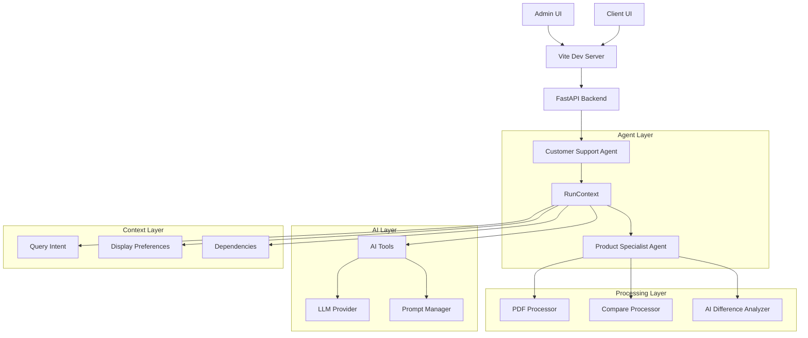
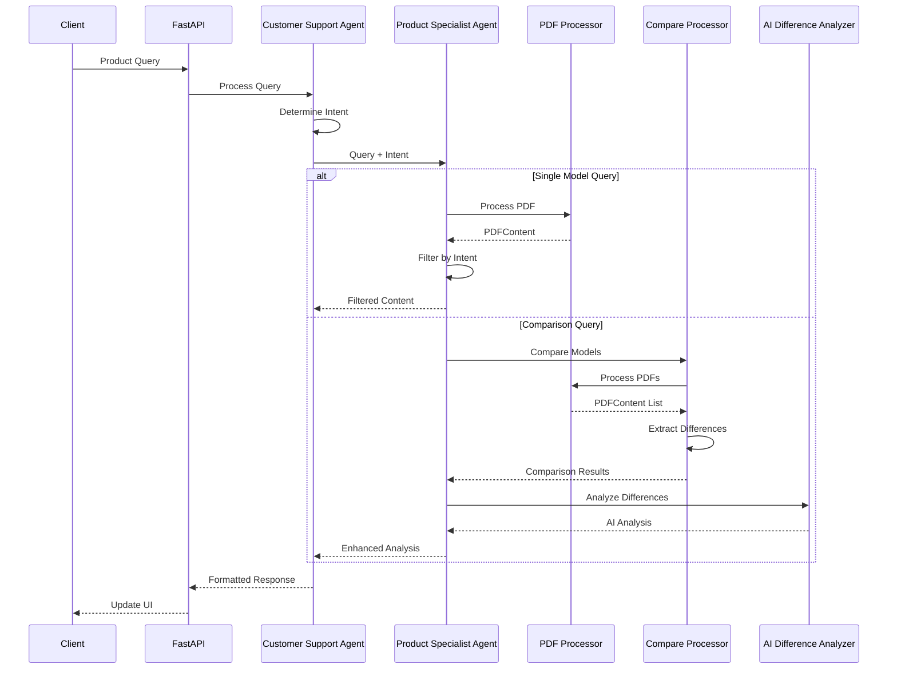

# AI-Driven Product Support System Architecture
Version: 4.0.0

## Overview

The system is built around a multi-agent architecture using Pydantic-AI v0.0.24, with agents communicating through RunContext for dependency injection and message passing. The architecture emphasizes direct AI-driven analysis and processing, optimized for an MVP implementation with focus on PDF processing, natural language understanding, and flexible output formatting.

## Core Components

### System Architecture


### Query Processing Workflow


## Component Details

### 1. RunContext & Dependencies

```python
class AgentDependencies(BaseModel):
    """Core dependencies shared across all agents."""
    usage_tracker: Usage
    model_name: str = "gpt-4-turbo-preview"
    temperature: float = 0.7
    display_preferences: DisplayPreferences

class DisplayPreferences(BaseModel):
    """Output format preferences."""
    output_format: Literal["json", "text", "dataframe"]
    sections_to_show: list[str]
    show_differences_only: bool
    include_metadata: bool
```

### 2. Query Intent & Domain

```python
class QueryIntent(BaseModel):
    """Structured understanding of user's query."""
    domain: QueryDomain
    topic: str
    sub_topic: str
    context: Dict[str, Any]

class QueryDomain(str, Enum):
    PRODUCT = "product"
    CASE_STUDY = "case_study"
    COMPANY = "company"
    CAREERS = "careers"
```

### 3. Agent System

#### Customer Support Agent [IMPLEMENTED]
```python
@ai.model
class CustomerSupportAgent(BaseAgent[AgentDependencies]):
    """Main orchestrator for customer interactions."""
    
    @ai.tool
    async def handle_query(
        self,
        query: str,
        model_numbers: List[str],
        context: RunContext[AgentDependencies]
    ) -> Response:
        """Handle customer query with domain validation."""
        query_intent = await self._determine_query_intent(query)
        if query_intent.domain != QueryDomain.PRODUCT:
            raise ValueError("Not a product query")
        return await self.product_specialist.analyze_products(
            model_numbers=model_numbers,
            query_intent=query_intent,
            context=context
        )
```

#### Product Specialist Agent [IMPLEMENTED]
```python
@ai.model
class ProductSpecialistAgent(BaseAgent[AgentDependencies]):
    """Technical specialist for product analysis."""
    
    @ai.tool
    async def analyze_products(
        self,
        model_numbers: List[str],
        query_intent: QueryIntent,
        context: RunContext[AgentDependencies]
    ) -> ProductAnalysis:
        """Analyze products based on query intent."""
        # Process PDFs directly
        pdf_data = {}
        for model in model_numbers:
            content = self.pdf_processor.get_content(model)
            if content:
                pdf_data[model] = content
                
        # Filter based on intent
        filtered_data = await self.filter_specifications(
            pdf_data=pdf_data,
            query_intent=query_intent,
            context=context
        )
        
        # For comparisons, use CompareProcessor
        if len(model_numbers) > 1:
            comparison = await self.compare_processor.compare_models(
                filtered_data,
                query_intent=query_intent
            )
            return ProductAnalysis(
                specifications=filtered_data,
                comparison=comparison,
                display_format=context.deps.display_preferences.output_format
            )
            
        return ProductAnalysis(
            specifications=filtered_data,
            display_format=context.deps.display_preferences.output_format
        )
```

### 4. Tool Layer

#### PDF Processor [IMPLEMENTED]
```python
class PDFProcessor:
    """Direct PDF processing without storage."""
    
    def get_content(self, model_number: str) -> PDFContent:
        """Get PDF content directly from file."""
        pdf_path = self._find_pdf(model_number)
        return self._extract_content(pdf_path)
```

#### Compare Processor [IMPLEMENTED]
```python
class CompareProcessor:
    """Process and compare multiple PDFs."""
    
    async def compare_models(
        self,
        pdf_data: Dict[str, PDFContent],
        query_intent: QueryIntent
    ) -> ComparisonResponse:
        """Compare multiple models with AI analysis."""
```

## Key Changes in v4.0.0

1. **Simplified Architecture**
   - Removed storage layer and database dependencies
   - Direct PDF processing without intermediate storage
   - Streamlined agent interactions

2. **MVP Focus**
   - Optimized for core functionality
   - Reduced infrastructure requirements
   - Faster response times

3. **Enhanced Comparison**
   - Direct model-to-model comparison
   - AI-driven analysis without storage overhead
   - Flexible output formatting

4. **Future Considerations**
   - Caching layer could be added if needed
   - Batch processing support can be implemented
   - Storage service could be reintegrated for persistence

## Directory Structure
```
src/ai_support_agent/
├── tests/                # Test files
│   ├── unit/
│   │   └── test_storage.py
│   └── integration/
│       └── test_workflow.py
└── migrations/          # Database migrations
    └── 001_initial.sql
```

## Implementation Status

### Completed Components [IMPLEMENTED]
1. Core Agent System
   - Customer Support Agent
   - Product Specialist Agent
   - RunContext and Dependencies

2. Tool Layer
   - PDF Processor
   - Compare Processor
   - Prompt Manager

### Pending Components [PENDING]
1. Frontend Implementation
   - React components
   - State management
   - API integration
   - UI/UX design

2. API Layer
   - Additional endpoints

3. Monitoring
   - Usage tracking
   - Basic error reporting

## Next Steps

1. Priority 1 [IN PROGRESS]
   - Complete frontend implementation


## Directory Structure
```
src/ai_support_agent/
├── agents/                 # Agent implementations
│   ├── customer_support.py [IMPLEMENTED]
│   └── product_specialist.py [IMPLEMENTED]
├── tools/                 # Tool implementations
│   ├── pdf_processor.py [IMPLEMENTED]
│   └── prompt_manager.py [IMPLEMENTED]
└── config/              # Configuration
    └── settings.py [IMPLEMENTED]
```

## Critical Implementation Requirements

This implementation follows these cursor rules:
- @[pydantic-ai.mdc](.cursor/rules/pydantic-ai.mdc) - PydanticAI v0.0.23 best practices
- @[pydantic.mdc](.cursor/rules/pydantic.mdc) - Pydantic v2.10 best practices
- @[python.mdc](.cursor/rules/python.mdc) - Python core best practices
- @[documentation.mdc](.cursor/rules/documentation.mdc) - Documentation standards

In case of conflicts between this document and cursor rules, the cursor rules take precedence.

### 1. AI Integration [implements @pydantic-ai.mdc]
- All AI components inherit from `BaseAIModel`
- All agents must use `@ai.model` decorator
- All tools must use `@ai.tool` decorator
- Model configuration via settings rather than hardcoded values
- System prompts defined with `@ai.system_prompt`
- AI configuration through `model_config`

### 2. Type Safety [implements @pydantic.mdc]
- Pydantic v2 for all models
- Zod schemas for frontend validation
- Schema compatibility testing
- Runtime validation

### 3. Agent Communication [implements @pydantic-ai.mdc]
- RunContext for dependency injection
- Proper agent delegation
- Message passing through context
- State management

### 4. Performance [implements @python.mdc]
- Async operations
- Connection pooling
- Batch processing for PDFs

### 5. Security
- Input validation
- Rate limiting
- Error handling
- Data sanitization

### 6. Logging [implements @pydantic.mdc]
- Structured logging with Logfire
- Pydantic v2.10 integration
- Context preservation

### 7. Query Processing [IMPLEMENTED]
- CSA determines query intent and domain
- PSA filters specs based on intent
- DifferencesTool analyzes focused differences
- All agents use RunContext for state

### 8. Display Formatting [IMPLEMENTED]
- Display preferences in RunContext
- Format control via API parameters
- PSA handles all formatting
- Multiple output formats supported

### 9. Domain Validation [IMPLEMENTED]
- CSA validates query domain
- Early rejection of non-product queries
- Clear error messages
- Future extensibility for other domains

## Next Steps

1. Priority 1 [IN PROGRESS]
   - Add more output formats
   - Enhance filtering capabilities
   - Add section validation
   - Improve error messages

2. Priority 2 [PENDING]
   - Add other domain specialists
   - Enhance comparison analytics
   - Add caching layer
   - Improve performance

3. Priority 3 [PENDING]
   - Add frontend components
   - Enhance monitoring
   - Add analytics
   - Complete documentation

Note: Frontend architecture details will be documented separately once backend implementation is solidified. 