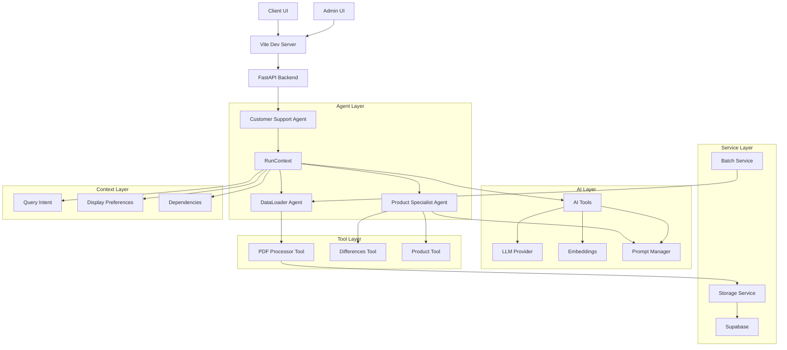
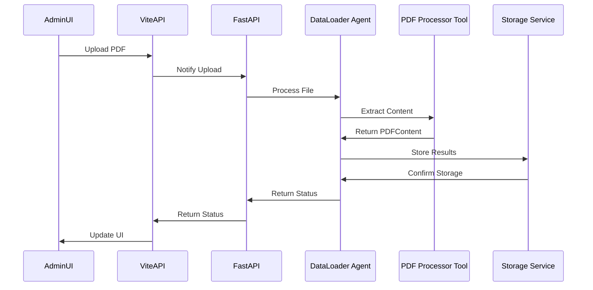
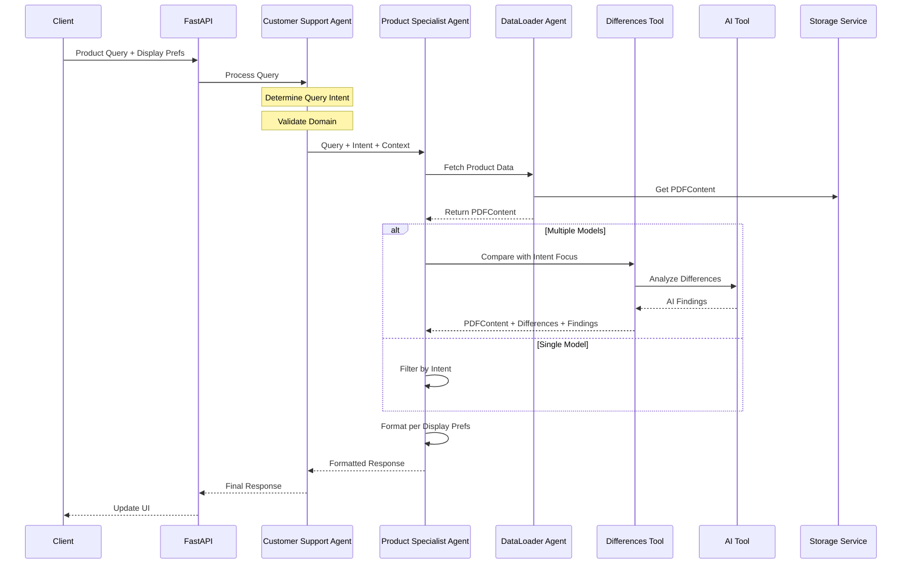

# AI-Driven Product Support System Architecture
Version: 3.2.0

## Overview

The system is built around a multi-agent architecture using Pydantic-AI v0.0.23, with agents communicating through RunContext for dependency injection and message passing. The architecture emphasizes AI-driven analysis over traditional database querying, with a focus on PDF processing, natural language understanding, and flexible output formatting.

## Core Components

### System Architecture


### Data Loading Workflow


### Query Processing Workflow


## Component Details

### 1. RunContext & Dependencies

```python
class AgentDependencies(BaseModel):
    """Core dependencies shared across all agents."""
    usage_tracker: Usage
    storage_service: SupabaseStorageService
    difference_service: DifferenceService
    model_name: str = "gpt-4-turbo-preview"
    temperature: float = 0.7
    display_preferences: DisplayPreferences

class DisplayPreferences(BaseModel):
    """Output format preferences."""
    output_format: Literal["json", "text", "dataframe"]
    sections_to_show: list[str]
    show_differences_only: bool
    include_metadata: bool
```

### 2. Query Intent & Domain

```python
class QueryIntent(BaseModel):
    """Structured understanding of user's query."""
    domain: QueryDomain
    topic: str
    sub_topic: str
    context: Dict[str, Any]

class QueryDomain(str, Enum):
    PRODUCT = "product"
    CASE_STUDY = "case_study"
    COMPANY = "company"
    CAREERS = "careers"
```

### 3. Agent System

#### Customer Support Agent [IMPLEMENTED]
```python
@ai.model
class CustomerSupportAgent(BaseModel):
    """Main orchestrator for customer interactions."""
    
    @ai.tool
    async def handle_query(
        self,
        query: str,
        model_numbers: List[str],
        context: RunContext[AgentDependencies]
    ) -> Response:
        """Handle customer query with domain validation."""
        query_intent = await self._determine_query_intent(query)
        if query_intent.domain != QueryDomain.PRODUCT:
            raise ValueError("Not a product query")
        return await self.product_specialist.get_product_info(
            model_numbers=model_numbers,
            query_intent=query_intent,
            context=context
        )
```

#### Product Specialist Agent [IMPLEMENTED]
```python
@ai.model
class ProductSpecialistAgent(BaseModel):
    """Technical specialist for product analysis."""
    
    @ai.tool
    async def get_product_info(
        self,
        model_numbers: List[str],
        query_intent: QueryIntent,
        context: RunContext[AgentDependencies]
    ) -> Dict[str, Any]:
        """Get filtered product info based on intent."""
        # Get and filter data
        filtered_data = await self._get_filtered_data(
            model_numbers, query_intent, context
        )
        
        # Format based on display preferences
        return self._format_response(
            filtered_data,
            context.deps.display_preferences
        )
```

#### DataLoader Agent [IMPLEMENTED]
```python
@ai.model
class DataLoaderAgent(BaseModel):
    """Agent responsible for processing and storing PDF content."""
    
    @ai.tool
    async def process_directory(
        self,
        data_dir: Path,
        context: RunContext[AgentDependencies]
    ) -> LoadResult:
        """Process all PDF files in a directory."""
        
    @ai.tool
    async def process_file(
        self,
        file_path: Path,
        context: RunContext[AgentDependencies]
    ) -> None:
        """Process a single PDF file."""
```

### 4. Tool Layer

#### DifferencesTool [IMPLEMENTED]
```python
@ai.model
class DifferencesTool(BaseModel):
    """Tool for analyzing differences between products."""
    
    @ai.tool
    async def analyze_differences(
        self,
        pdf_data: Dict[str, PDFContent],
        query_intent: QueryIntent,
        context: RunContext[AgentDependencies]
    ) -> Dict[str, object]:
        """Analyze differences between products."""
```

Features:
- AI-powered difference analysis
- Query intent filtering
- Specific recommendations
- Confidence scoring

#### PDF Processor [IMPLEMENTED]
```python
class PDFProcessor:
    """Service for processing PDF specifications."""
    
    def get_content(self, model_input: str) -> PDFContent:
        """Get PDF content as a validated PDFContent object."""
```

Features:
- Text extraction with pdfplumber
- Table structure parsing
- Feature and advantage extraction
- Model number extraction
- Diagram extraction

### 5. Service Layer

#### Storage Service [IMPLEMENTED]
```python
class SupabaseStorageService:
    """Service for managing PDF data storage."""
    
    async def store_pdf_data(self, content: PDFContent) -> None:
        """Store complete PDFContent model with type information."""
        
    async def get_pdf_data(self, model_number: str) -> PDFContent:
        """Retrieve and reconstruct PDFContent model."""
```

Features:
- Type-safe storage
- Complete model preservation
- Async operations
- Error handling

### Data Storage Pattern [IMPLEMENTED]

```python
# Storage Format
{
    "model_number": str,                    # Unique identifier
    "data": {
        "__pydantic_type__": str,          # Full module path to model
        "content": PDFContent              # Complete model data
    },
    "created_at": datetime,
    "updated_at": Optional[datetime]
}
```

## PDF Data Storage and Testing Plan

### 1. Database Schema [PENDING]
```sql
-- PDF Data Table
CREATE TABLE pdf_data (
    id UUID PRIMARY KEY DEFAULT uuid_generate_v4(),
    model_number TEXT NOT NULL UNIQUE,
    data JSONB NOT NULL,
    created_at TIMESTAMP WITH TIME ZONE DEFAULT NOW(),
    updated_at TIMESTAMP WITH TIME ZONE,
    CONSTRAINT valid_model_number CHECK (model_number ~ '^[0-9]+[RFW]?$')
);

-- Basic index for lookups
CREATE INDEX idx_pdf_data_model_number ON pdf_data(model_number);
```

### 2. Storage Service Enhancements [IN PROGRESS]

1. Basic Batch Operations
```python
class SupabaseStorageService:
    """Enhanced storage service with basic batch operations."""
    
    async def store_batch(
        self,
        contents: List[PDFContent]
    ) -> BatchResult:
        """Store multiple PDFContent objects."""
        
    async def get_batch(
        self,
        model_numbers: List[str]
    ) -> Dict[str, PDFContent]:
        """Retrieve multiple PDFContent objects."""
```

2. Basic Validation
```python
class StorageValidator:
    """Basic validation for storage operations."""
    
    async def validate_content(
        self,
        content: PDFContent
    ) -> bool:
        """Validate PDFContent before storage."""
```

### 3. Testing Infrastructure [PENDING]

1. Basic Unit Tests
```python
class TestPDFStorage:
    """Basic test suite for PDF storage."""
    
    async def test_store_pdf_data(self):
        """Test storing single PDFContent."""
        
    async def test_batch_operations(self):
        """Test basic batch operations."""
```

2. Basic Integration Tests
```python
class TestStorageIntegration:
    """Basic integration tests."""
    
    async def test_end_to_end_storage(self):
        """Test basic storage workflow."""
```

### 4. Implementation Steps

1. Database Setup [PRIORITY 1]
   - Create basic table
   - Add model number index
   - Set up test database

2. Storage Service [PRIORITY 1]
   - Implement basic batch operations
   - Add basic validation
   - Add basic error handling

3. Testing Suite [PRIORITY 1]
   - Set up pytest
   - Add basic unit tests
   - Add basic integration tests

### 5. Testing Strategy

1. Unit Testing
   - Test CRUD operations
   - Test data transformations
   - Test error cases

2. Integration Testing
   - Test basic workflow

### 6. Success Criteria

1. Functionality
   - Store/retrieve PDFs works
   - Basic batch operations work
   - Basic error handling works

2. Basic Performance
   - Operations complete in reasonable time
   - No obvious bottlenecks

### 7. Implementation Schedule

Week 1:
- Set up basic database schema
- Implement basic tests
- Add basic batch operations


## Directory Structure
```
src/ai_support_agent/
├── tests/                # Test files
│   ├── unit/
│   │   └── test_storage.py
│   └── integration/
│       └── test_workflow.py
└── migrations/          # Database migrations
    └── 001_initial.sql
```

## Implementation Status

### Completed Components [IMPLEMENTED]
1. Core Agent System
   - Customer Support Agent
   - Product Specialist Agent
   - DataLoader Agent
   - RunContext and Dependencies

2. Tool Layer
   - DifferencesTool
   - PDF Processor
   - Prompt Manager

3. Service Layer
   - Storage Service
   - Difference Service
   - LLM Provider

4. Type System
   - PDFContent model
   - Difference models
   - Query models
   - Display preferences

### Pending Components [PENDING]
1. Frontend Implementation
   - React components
   - State management
   - API integration
   - UI/UX design

2. API Layer
   - Additional endpoints

3. Monitoring
   - Usage tracking
   - Basic error reporting

## Next Steps

1. Priority 1 [IN PROGRESS]
   - Complete frontend implementation


## Directory Structure
```
src/ai_support_agent/
├── agents/                 # Agent implementations
│   ├── customer_support.py [IMPLEMENTED]
│   ├── product_specialist.py [IMPLEMENTED]
│   └── dataloader_agent.py [IMPLEMENTED]
├── tools/                 # Tool implementations
│   ├── pdf_processor.py [IMPLEMENTED]
│   ├── differences_tool.py [IMPLEMENTED]
│   └── prompt_manager.py [IMPLEMENTED]
├── services/             # Core services
│   ├── storage_service.py [IMPLEMENTED]
│   └── difference_service.py [IMPLEMENTED]
├── types/                # Shared types
│   ├── agent.py [IMPLEMENTED]
│   ├── pdf.py [IMPLEMENTED]
│   └── differences.py [IMPLEMENTED]
└── config/              # Configuration
    ├── context.py [IMPLEMENTED]
    └── settings.py [IMPLEMENTED]
```

## Critical Implementation Requirements

This implementation follows these cursor rules:
- @[pydantic-ai.mdc](.cursor/rules/pydantic-ai.mdc) - PydanticAI v0.0.23 best practices
- @[pydantic.mdc](.cursor/rules/pydantic.mdc) - Pydantic v2.10 best practices
- @[python.mdc](.cursor/rules/python.mdc) - Python core best practices
- @[documentation.mdc](.cursor/rules/documentation.mdc) - Documentation standards

In case of conflicts between this document and cursor rules, the cursor rules take precedence.

### 1. AI Integration [implements @pydantic-ai.mdc]
- All AI components inherit from `BaseAIModel`
- All agents must use `@ai.model` decorator
- All tools must use `@ai.tool` decorator
- Model configuration via settings rather than hardcoded values
- System prompts defined with `@ai.system_prompt`
- AI configuration through `model_config`

### 2. Type Safety [implements @pydantic.mdc]
- Pydantic v2 for all models
- Zod schemas for frontend validation
- Schema compatibility testing
- Runtime validation

### 3. Agent Communication [implements @pydantic-ai.mdc]
- RunContext for dependency injection
- Proper agent delegation
- Message passing through context
- State management

### 4. Performance [implements @python.mdc]
- Async operations
- Connection pooling
- Batch processing for PDFs

### 5. Security
- Input validation
- Rate limiting
- Error handling
- Data sanitization

### 6. Logging [implements @pydantic.mdc]
- Structured logging with Logfire
- Pydantic v2.10 integration
- Context preservation

### 7. Query Processing [IMPLEMENTED]
- CSA determines query intent and domain
- PSA filters specs based on intent
- DifferencesTool analyzes focused differences
- All agents use RunContext for state

### 8. Display Formatting [IMPLEMENTED]
- Display preferences in RunContext
- Format control via API parameters
- PSA handles all formatting
- Multiple output formats supported

### 9. Domain Validation [IMPLEMENTED]
- CSA validates query domain
- Early rejection of non-product queries
- Clear error messages
- Future extensibility for other domains

## Next Steps

1. Priority 1 [IN PROGRESS]
   - Add more output formats
   - Enhance filtering capabilities
   - Add section validation
   - Improve error messages

2. Priority 2 [PENDING]
   - Add other domain specialists
   - Enhance comparison analytics
   - Add caching layer
   - Improve performance

3. Priority 3 [PENDING]
   - Add frontend components
   - Enhance monitoring
   - Add analytics
   - Complete documentation

Note: Frontend architecture details will be documented separately once backend implementation is solidified. 